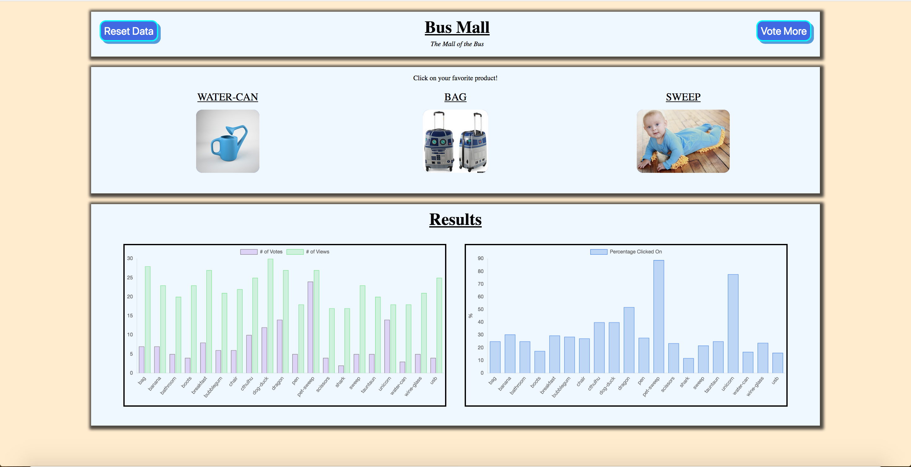

# [bus-mall](https://nguyenvinh2.github.io/bus-mall/)

## Introduction

    BusMall is a simulated Web Application designed to collect and capture user preferences on a 
    list of imaginary items based on a polling system.

## Explantion

    This Web Application uses JavaScript to randomly display 3 item images at a time in rotation 
    (and never show any image twice in a row) and asks the user to select the most prefered item. 
    The application will collect the polling data and display the results at the end once the user 
    has provided enough data.

    Local Storage is used for data persistence so the user doesn't not have to restart the process
    after exiting the application.

## Author

    Vinh Nguyen

## Installation

    No installation is needed.

    You may clone this repo and utilize it to your liking.

    VSCODE is recommended for editing files.

## Version

    V0.5: 4/08/19: Images rendered in JS. Voting mechanics completed.
    V.06: 4/09/19: Added Charts for displaying results. Style work
    V0.7: 4/10/19: Added Local Storage for data persistence.
    V1.0: 4/11/19: Refactored to avoid reloading browser. Application completed.

## Output

